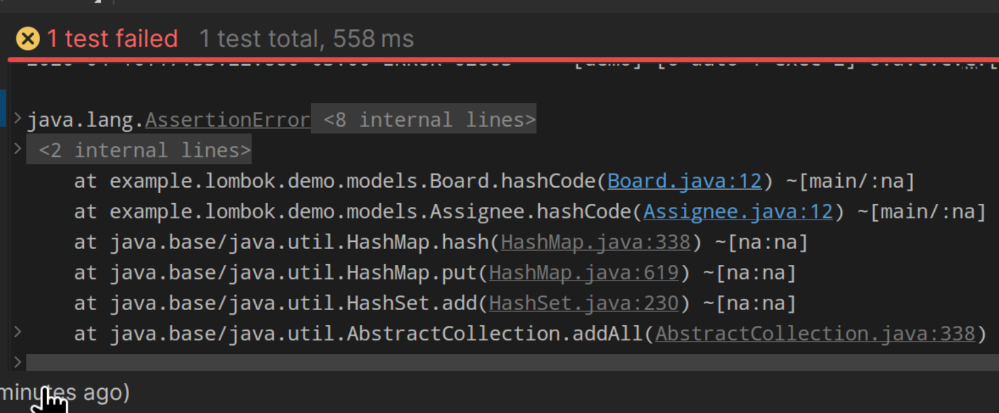

# lombok: The Good, the Bad and the Ugly

Lombok is a popular Java library that simplifies boilerplate code by generating getters, setters, constructors, and
other common methods at compile time. While it can significantly improve productivity, it also introduces potential
pitfalls that developers should be aware of. This guide explores the benefits and drawbacks of using Lombok in Java
projects.

## The good

- @AllArgsConstructor
- @ToString
- @Builder
- @With
- @Log

## The bad

- @Data
- @EqualsAndHashCode
- @SneakyThrows
- @FunctionalInterface

## The ugly

- To make its magic, lombok relies on internal jdk apis that are subject to
  change with no extended notice.
- Also this:
  
  These `hashCode` functions do not exist.

## Rationale

This is a rather simple example on how things can go off track quickly in a
lombok project. This is not even a complex example.

In a real project, the issue would not be that obvious.

So, what to do?

### This is a small proof of concept

No worries, go lombok all the way down.

### I have a tight schedule on this project

_And I need builders, magic constructors and fluent interfaces for free._

Go ahead, just avoid the bad parts and try to. avoid the ugly ones.

### This is a curated, long planned piece of code

_With a well-documented architecture and will be maintained by other people_

So, you're not staying around on this, instead you're going to evolve/create
**`The nex big thing™`**.

In that case, The discipline over the codebase involves code quality, The
industry's best practices documented in the literature and the active evasion of
any tool and pattern that is not future-proof or compliant with all related to
the good architectural standards.

Lombok can be called future-proof, although it can, theoretically, break with no
previous notice, but the fact that it has this error surface exposed, this is
enough to assume that those bad items and ugly ones are subject to happen.

Maybe not with you. Maybe not with me. But with the poorl soul looking at a
collapsed stacktrace hiding a call to a method that does not exists, wrapped
inside an unrelated exception.

## What is the moment of your project?

Lombok Is a productivity tool. This is undeniable.

But if long-term maintenance is important, then The mentality changes.

That said, lombok has an error surface that is not ignorable.

Think about the future.
